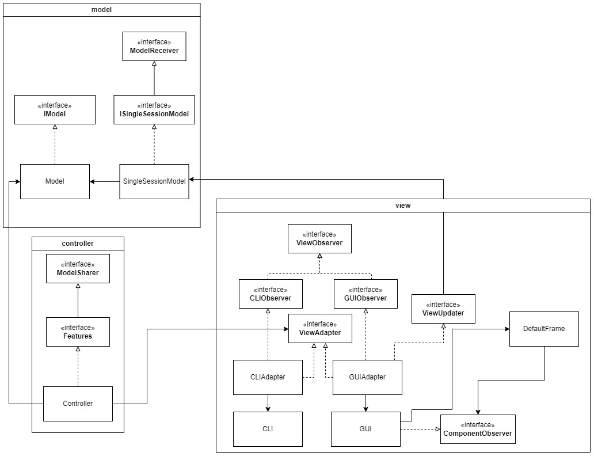

# Graphical Image Manipulation Application
---
This application is designed with Java and uses Swing for GUI. The purpose of this application is to carry out various image operations such as rotate, grayscale, channel filtering, compression and so on. An MVC approach has been followed when designing classes for this application.


# Design Architecture


---
# Key Design Changes
# 1. ArgumentHandler
## Premise
Until now, argument handling has been delagated to each command. The controller simply relays user input to the model, and the model executes the called command and passes the arguments without any validation. This is a very simple and compartmentalized approach which was desired because of ease of extension. But, as more and more commands were added, there was a need for efficiency. Relaying the command arguments without any validation leads to unnecessary usage of the model package. Hence, we decided to delegate the argument handling to the controller.
## Overview
Following is a brief overview of the changes and additions made:
1. The controller is now tasked with argument handling.
2. The CommandFactory also houses information about the arguments that each command takes.
3. An argument signature can be defined using the `Signature` class. This takes in a variable number of `ArgumentType` enum constants.
4. Arguments are now packaged by using the `ArgumentWrapper` class.
5. The `ArgumentWrapper` class be constructed to accept arguments that match a certain `Signature`.
## `arguments` package
The `arguments` package defines the various utility methods for setting up and handling arguments. It is composed of:
- An `Argument` interface.
- Concrete implementations of the argument interface are different type of supported
  arguments. We require `int`, `String` and `File` types for our arguments. Hence, we add
  the 3 concrete implementations of the `Argument` interface.
- An `ArgumentWrapper` class consists of an internal `Map` to map the argument (ordering)
  number to the `Argument` value. An instance of this class can be constructed by passing multiple `Argument` types (variable length).
- Additionally, the `ArgumentWrapper` can be constructed using an expected signature. Let's say we need 3 arguments where the order of the expected signatures are `File`, `String` and `Integer`. We can define this for an `ArgumentWrapper`. When we input the arguments into the `ArgumentWrapper`, an `IllegalArgumentException` is thrown if the types don't match the signature.

```java

```

# Major Refactoring operations
## Reasons for consideration
- The view (GUI) needs to be able to communicate with the controller about which command has been
  invoked by the user. Along with this, the view also needs to communicate the parameters.
- This refactor was *considered unnecessary* until now because the command and the arguments were
  passed as `String` objects to the model when the application solely depended on the CLI for user
  input.

> The current design can still support the addition of a GUI. But, it involves construction of the
> command string and passing it to the model. Then the model again deconstructs the string into
> arguments. This is an inefficient method because of an unncessary layer of depending on strings.

- From a design perspective, the current design fails to seperate the actions of the model and
  controller effectively. The controller essentially passes everything to the model and expects it
  to take care of all the validation. However, the role of the `controller` is to orchestrate the
  validation and calling the appropriate method on the model. The role of the `model` is to *take
  care* of the business logic alone and not concern about the user input.

## Key Objectives

- The controller should handle the user input and delegate to the model by calling on the
  appropriate command and passing the arguments.
- The view must be able to clearly define without overhead, the command that has been invoked by the
  user and pass the arguments without overhead.

> Overhead here refers to avoiding tedious steps such as converting back and forth from strings.

- While we are aware that pulling the Command Factory out of the model into the controller will
  increase coupling, we intend to keep it as minimal as possible to ensure the extension of the
  model.
- When extending the model, the only changes that are required must involve a static registration of
  the new command, the command class itself, and its invoking UI component in the view. The
  controller must ideally remain unchanged.
- We also want to ensure existing code remains minimally unchanged.

## Known Pitfalls

- This refactor will **increase the coupling** between the model and controller as it may require
  editing the controller when a new command is added.

> Until now, extension of the model to add a new command was straightforward and did not involve
> making changes to the controller package.
> To add a new command:
> - Create the command class in the `model.command` package.
> - Add a new entry to the `command.CommandEnum`class in the model.
>
> As you can notice, at no point is the `controller` package modified.

Hence we need to ensure that this refactor results in little to no changes to the controller when
the model is extended.

## Highlights of the refactor

- Instead of having to rely on a static implementation of an enumeration, we will register the
  commands into the controller at runtime. When the model is instantiated and passed to the
  controller, the controller will request the model for details on all the commands and register
  them on a `Map`.

```java
// in app.App.main()
Controller controller = new Controller(in, out);
controller.run(new Model(), new View());

// in controller.Controller.run():
    this.commandMap = model.registerCommands(); // expects a HashMap of the commands from the model.
```
- We are introducing the `arguments` package to handle the command arguments.
    - An argument interface.


```java
import utils.arguments.ArgumentWrapper;
import utils.arguments.FileArgument;
import utils.arguments.StringArgument;
// in the controller/view:
ArgumentWrapper args = new ArgumentWrapper(new FileArgument("/res/app/newkoala.png"), new StringArgument("koala"));

// in the model (for example):
args.getFileArgument(0) // returns a file.
args.getStringArgument(1) // returns a string.
// incorrect calling results in IllegalArgumentException
args.getIntArgument(1) // throws IllegalArgumentException.
```

- The view will maintain a list of commands that it is using. During runtime, the view will register
  with the controller, all the commands it intends to use. If the controller is unable to map a
  model command to a view command then it'll throw a `RuntimeException`. For this, we have introduced a method in the controller's interface that is exposed to the view to verify all the commands.
    - This setup enforces a clear contract between the view and the controller: the view declares
      what commands it expects to use, and the controller confirms if they’re available. This can
      make both components easier to test, as each has a defined set of commands.
    - If new commands are added in the model, we'll immediately know if the view hasn’t accounted
      for them, allowing for a clean extension process.

```java
// the view:
controller.verifyCommands(this);
```
- A new method is added to the controller interface which is exposed to the view to invoke a command.
```java
// in the view:
controller.invokeCommand(Command c, ArgumentWrapper args);
```
## Details of the refactor
### IModel
- This interface is the main interface that is implemented by the `Model` facade class.
- It currently extends existing interfaces `ModelRunner`, `HistogramCacheProvider` and `ImageCacheProvider`.
- This interface defines a method `getAllCommandRunnables()` which returns a `Map<String, Runnable>` to inform the calling object about its available commands and how to call them.


# Key Design Changes

## Model Interface Implementation
The Model class has been restructured to implement multiple interfaces, following the Interface Segregation Principle:

**Current Design:**
- Model implements three distinct interfaces:
    1. `ModelRunner`: Handles command execution
    2. `ImageCacheProvider`: Manages image operations
    3. `HistogramCacheProvider`: Manages histogram operations

**Benefits:**
- Separation of concerns
- Enables future extensions without modifying existing code


## Key Abstractions in `command` package

The library's architecture evolved to better handle different types of image operations:

1. **Initial Design**
- Commands extended either `AbstractCommand` or `Abstract2ArgCommand`
- All operations were treated uniformly regardless of their nature
- Worked well for operations like flip that operate on the whole image

2. **Pixel-based Operations**
- Operations like luma, brightness, sepia needed to work on individual pixels
- Introduced `ImageProcessor` to handle pixel-by-pixel operations
- Added `processImage()` method to standardize pixel processing

3. **Simple Transformations**
- For operations that transform each pixel independently (brightness, sepia, etc.)
- Introduced `SimpleImageProcessor` with `PixelTransformer` interface
- Uses lambda functions to define pixel-level transformations

4. **Kernel-based Filters**
- Operations like blur and sharpen depend on neighboring pixels
- Introduced `Filter` class extending `ImageProcessor`
- Handles convolution operations that need pixel neighborhoods

> The class hierarchy looks like this after refactoring:
>```
>AbstractCommand
>├── Abstract2ArgCommand (for whole-image operations)
>└── ImageProcessor (for pixel-based operations)
>    ├── SimpleImageProcessor (single-pixel transformations)
>    └── Filter (neighborhood operations)
>```

## Cache Implementation Changes
The cache system has undergone significant architectural improvements:

**Previous Version:**
- Cache was exclusively for images
- Implemented as a static inner class within the Image class
- Limited to single-type storage

**Current Version:**
- Standalone Cache class managed by the Model
- Supports multiple data types (images and histograms)
- Uses interface-based design for type safety
- Easily extensible for new data types

### How to extend:
To add support for a new data type:
1. Define a new interface (e.g., `NewTypeCacheable`)
2. Add the interface to Cache's implementation
3. Implement the required methods in Cache

```java
// Example of adding a new cacheable type
public interface NewTypeCacheable {
    NewType get(String name);
    void set(String name, NewType value);
}

public class Cache implements HistogramCacheable, ImageCacheable, NewTypeCacheable {
    // Implement new methods...
}
```

## Implementation Details

### Command Processing Flow

1. User input is received by the Controller
2. Commands are parsed by CommandExecutor
3. IO operations are handled by IOHandler and ImageHandler
4. Image processing is delegated to the Model
5. Results are output to the specified stream

# Overview - Model Package

## `command` package
the command package maintains all commands. The CommmandEnum serves as the sole public entry point for the command package, representing a collection of commands for various operations in the image processing application. This class implements the factory pattern to facilitate the dynamic instantiation of command classes that implement the Command interface. 
### Add a new command:
- Create the class inside `command` package and extend `AbstractCommand`. 
- Add an entry into the `CommandEnum` enumeration.

```java
NEW_COMMAND(NewCommandClass.class, "command_name");
```

### Adding a New Command (V2)
- Determine if the new operation modifies each pixel individually; if so, it should extend `SimpleImageProcessor`.
- For kernel-based operations (e.g., blur or sharpen), extend `Filter`.
- If the operation processes the entire image at once (like a flip), extend `AbstractCommand`
 or `Abstract2ArgCommand` if it takes only 2 arguments namely: image and new image alias.
### Model
The `Model` class serves as the main entry point to the model package. It implements:
- Command execution system
- Image cache management
- Image retrieval and storage operations

#### Usage Example
```java
// Initialize the model
Model model = new Model();

// Execute a command
model.execute("blur", "koala koala_blurred");

// Retrieve an image
int[][][] image = model.getImage("koala");

// Store an image
model.setImage(image, "rabbit");
```

### Cache
The `Cache` class provides temporary storage for multiple data types using a HashMap-based implementation. It supports:
- Type-safe storage and retrieval through interfaces
- Support for images and histograms
- Extensible design for future data types

### Interfaces

#### ModelRunner
Defines the contract for executing commands within the model:
- `execute(String command, String args)`: Processes commands with their arguments

#### ImageCacheable
Handles image-related operations:
- `getImage(String name)`: Retrieves image data as a 3D array `[width][height][num_channels]`
- `setImage(int[][][] image, String name)`: Stores image data in the cache

#### HistogramCacheable
Manages histogram-related operations:
- `isHistogram(String name)`: Checks for histogram existence
- `getHistogram(String name)`: Retrieves histogram data as a 2D array `[num_channels][bins]`

## Data Formats

### Image Data
Images are stored as 3D arrays with the following dimensions:
- Width: Image width in pixels
- Height: Image height in pixels
- Channels: Number of color channels (e.g., RGB, RGBA)

### Histogram Data
Histograms are stored as 2D arrays with the following dimensions:
- Number of channels (default: 3)
- Number of bins (default: 256)
### Controller Package

The controller package manages user input and coordinates between the model and view:

### `Controller`
- **Role**: Manages command flow, processes input commands, and handles scripts.
- **Core Methods**:
    - `run(Model model)`: Initiates the command loop, processing commands until a quit command is encountered.

- **Script Execution**: The `Controller` supports script-based commands by using the `ScriptHandler` class to read commands from a specified file.
- **Input/Output**: Reads from an `InputStream` and outputs to a `PrintStream`, making it adaptable to different input sources.

**Example**:
```java
InputStream in = System.in;
PrintStream out = System.out;
Model model = new Model();
Controller controller = new Controller(in, out);
controller.run(model);
```

#### Core Components

1. **Controller**: Main controller class that:
    - Manages input/output streams
    - Processes user commands
    - Handles script execution
    - Coordinates with the model

2. **CommandExecutor**:
    - Parses and executes individual commands
    - Routes commands to appropriate handlers

3. **IOHandler**:
    - Manages file input/output operations
    - Selects appropriate image handlers
    - Handles loading and saving of images

4. **ScriptHandler**:
    - Reads and processes script files
    - Filters comments and empty lines
    - Returns executable commands

5. **HistogramGenerator**:
    - Generates visual representations of image color distributions
    - Creates color-coded histograms for RGB channels
    - Outputs histogram as an image

## Classes in `controller` Package

### 1. **IOHandler**

Responsible for executing commands for image loading and saving. Works with the model and selects image handlers based on file extension.

- **Constructor**:
  ```java
  IOHandler(Model model, String command, String args) throws IOException;
  ```
- **Methods**:
    - `createParentDirectories()`: Creates directories for file paths if needed.
    - `commandSelector()`: Selects and executes "load" or "save" commands.

---

### 2. **ScriptHandler**

Reads script files containing multiple commands to be executed sequentially.

- **Constructor**:
  ```java
  ScriptHandler(String path);
  ```
- **Methods**:
    - `getCommands()`: Returns a list of commands, ignoring comments and blank lines.

---

### 3. **HistogramGenerator**

Generates histogram images from pixel data, providing visual representation of image characteristics.

- **Constructor**:
  ```java
  HistogramGenerator(int[][] histogram);
  ```
- **Methods**:
    - `getImage()`: Returns the histogram image as a 3D array.
    - `drawGrid(Graphics2D g)`, `drawAxes(Graphics2D g)`: Methods for drawing gridlines and axes on the histogram.
    - `convertTo3DArray(BufferedImage)`: Converts BufferedImage into a 3D pixel array.

---

## `controller.imagehandler` Package

The `imagehandler` package includes abstractions and implementations for handling various image formats. It provides interfaces and classes to load and save images, ensuring flexibility in supporting multiple formats.

### Key Classes

#### 1. **ImageHandler Interface**

Defines methods for loading and saving images. Each format (e.g., PNG, JPG, PPM) implements this interface to handle its specific file structure.

- **Methods**:
    - `loadImage()`: Loads an image and returns it as a 3D array.
    - `saveImage(int[][][] image)`: Saves the provided image data to a file.

#### 2. **AbstractImageHandler**

Serves as a base class, offering shared functionality (e.g., handling file paths) for specific format handlers like PNG, JPG, and PPM.

#### 3. **CommonImageHandler**

Handles common formats like PNG, JPG, and JPEG using `BufferedImage` for image reading and writing.

- **Constructor**:
  ```java
  CommonImageHandler(String path, String extension);
  ```
- **Methods**:
    - `loadImage()`: Reads image and returns RGB pixel data as a 3D array.
    - `saveImage(int[][][] pixelData)`: Saves RGB pixel data to file.

#### 4. **PPMHandler**

Special handler for the PPM (Portable Pixel Map) format, reading and writing image data specific to the PPM structure.

- **Constructor**:
  ```java
  PPMHandler(String path, String extension);
  ```
- **Methods**:
    - `loadImage()`: Reads PPM image and returns RGB pixel data as a 3D array.
    - `saveImage(int[][][] image)`: Writes RGB pixel data to a PPM file.

#### 5. **ImageHandlerSelector**

Maps file extensions (e.g., `.png`, `.jpg`, `.ppm`) to the correct handler and dynamically instantiates the appropriate handler based on the file extension.

---

### Extending `controller.imagehandler`

To add support for a new image format:
1. **Create a New Handler**: Implement the `ImageHandler` interface for the new format (e.g., BMPHandler).
2. **Define Load and Save Logic**: Add the logic in `loadImage()` and `saveImage()` methods.
3. **Register in ImageHandlerSelector**: Update the `ImageHandlerSelector` enum with the new file extension and class.

---

# Image Licenses

Photo by mark broadhurst: https://www.pexels.com/photo/blue-orange-and-green-bird-on-yellow-flower-105808/

Photo by Srikanth Popuri: https://www.pexels.com/photo/close-up-photography-of-egyptian-starcluster-713777/

Photo by Lucie Liz: https://www.pexels.com/photo/doughnuts-on-pink-surface-4945142/